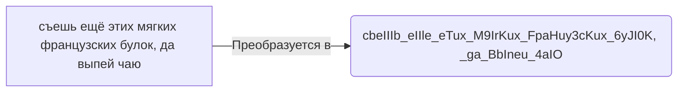

# Что это такое ?

Простой инструмент для преобразования русского(кирилица) текста в латинские символы.

## Возможности

- Простой и минималистичный интерфейс
- Мгновенный перевод при вводе

## Пример работы

